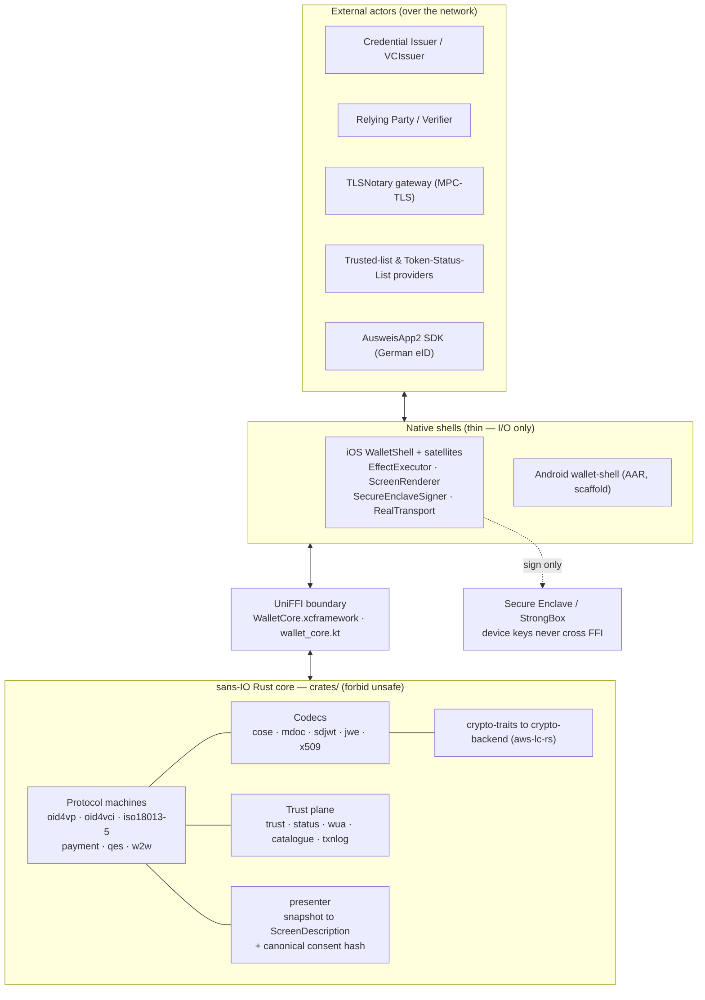
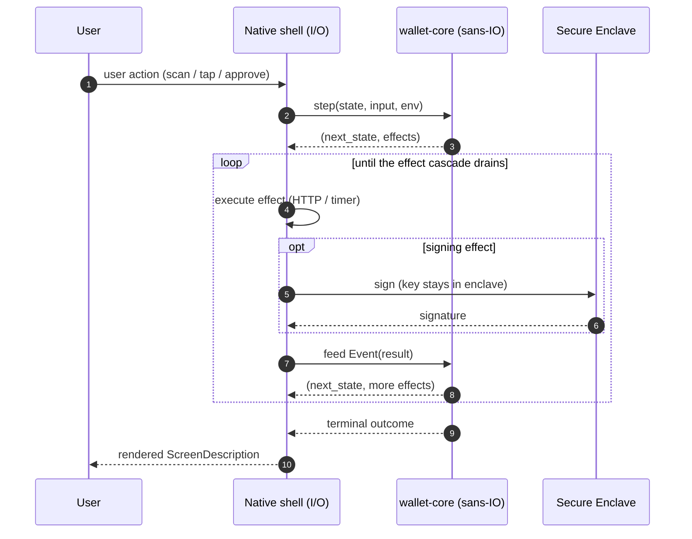
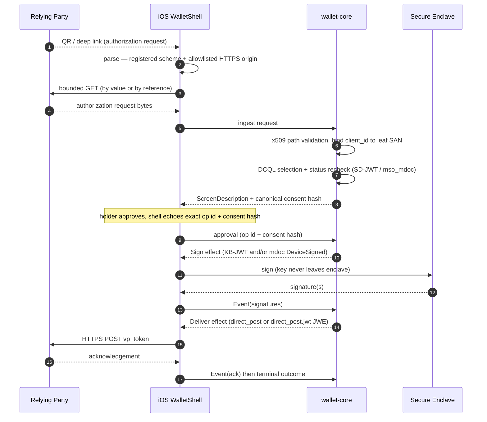
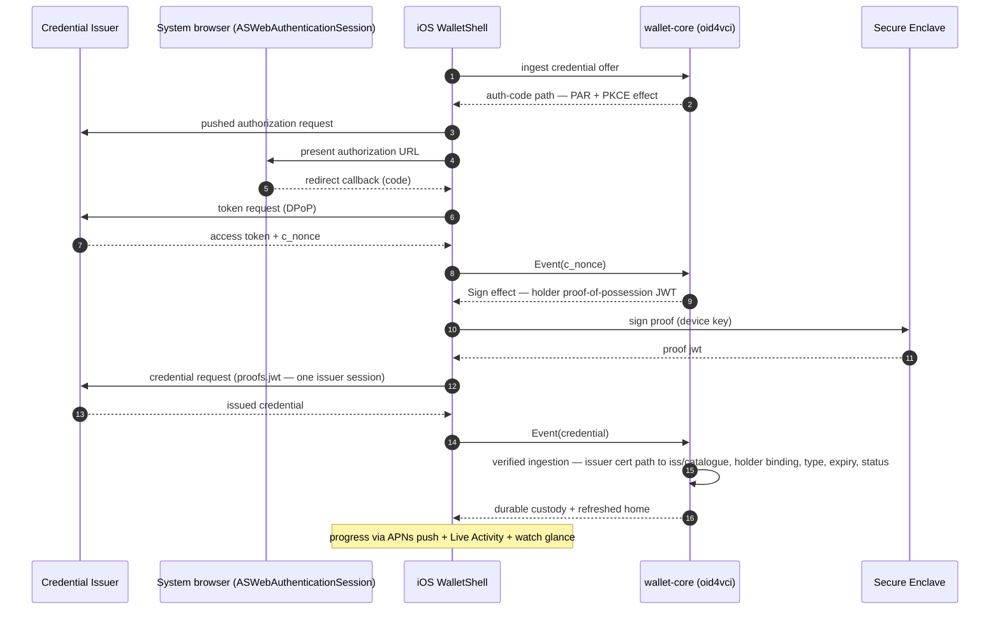
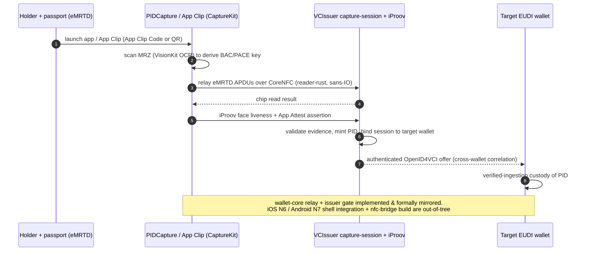
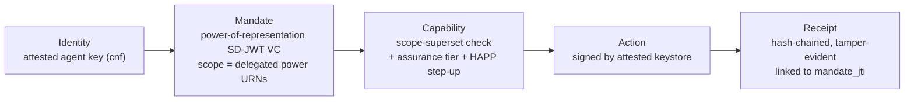
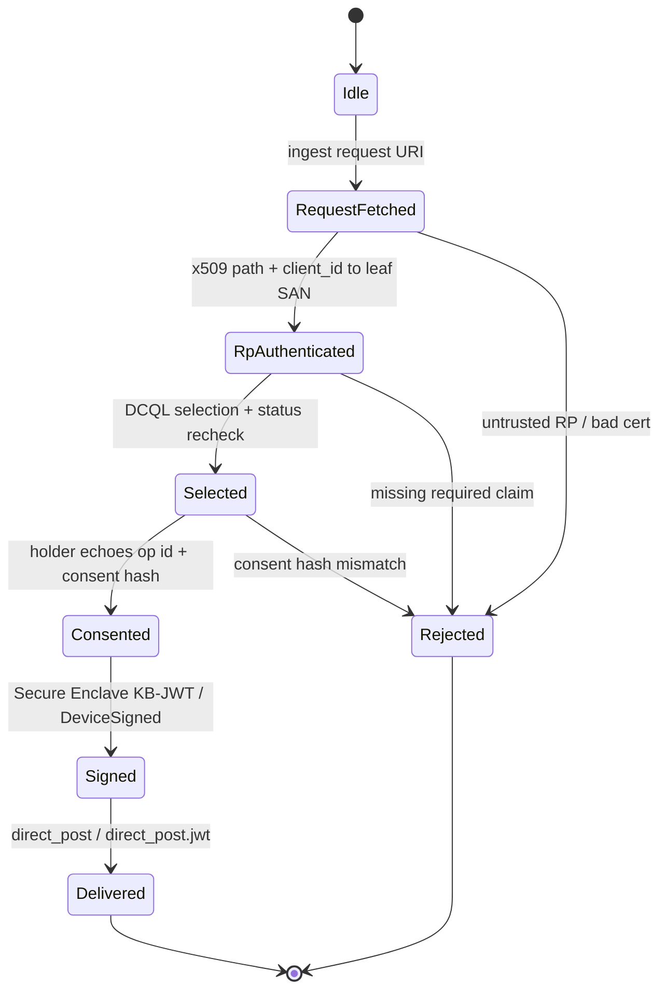
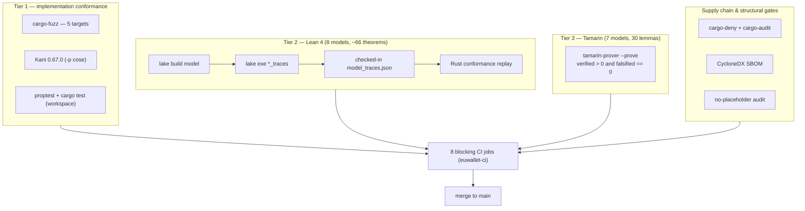

# euwallet — EUDI Wallet (Rust core · Swift shell · formally verified)

[](https://github.com/advatar/EUWallet/actions/workflows/ci.yml)


An independent, from-scratch **German/EU Digital Identity (EUDI) Wallet** whose security-critical
logic lives entirely in a **sans-IO Rust behaviour core**, driven by **thin native shells**
(Swift/iOS today, Kotlin/Android scaffolded), and held to **three formal-assurance tiers wired as
blocking CI gates**: property/fuzz/Kani → Lean 4 state-machine proofs → Tamarin protocol analysis.

Grounded in the EUDI specification register (as of **2026-07-17**): **ARF v2.9.0**, **PID Rulebook
v1.7**, **FCAF v0.0.7**. The full, junior-developer-followable build plan is
[`docs/IMPLEMENTATION_PLAN.md`](docs/IMPLEMENTATION_PLAN.md).

## Security status

EUWallet is **not yet production-certified**. An independent pre-launch security review remains a
launch gate — see [`docs/SECURITY_AUDIT.md`](docs/SECURITY_AUDIT.md). Independent audit,
penetration testing, official OIDF/FCAF/German-sandbox conformance, CAB/BSI certification, and
Commission listing are all **explicit external gates**. Implementation evidence in this repository
does **not** replace the applicable Member-State certification and Commission listing. This
README describes what is *built and tested*, and is careful to fence what is *experimental*,
*development-only*, or *proposed*.

---

## What & why

Most wallet stacks scatter protocol logic, crypto, and I/O across a native app where it is hard to
test and impossible to prove. EUWallet inverts that. Every protocol is a **pure state machine**:

```
step(state, input, env) -> (next_state, effects)
```

The core never touches the network, clock, screen, or keys. It emits *effects* (fetch this URL,
sign this, start a timer); the native **shell** performs the I/O and feeds *events* back until the
effect cascade drains. Because the core is deterministic and side-effect-free, the *same audited
logic* runs on every platform (via [UniFFI](https://mozilla.github.io/uniffi-rs/)), is fuzzable and
Kani-checkable in isolation, and is **mirrored by machine-checked Lean models** whose legal traces
are replayed against the Rust implementation in CI.

Two invariants are load-bearing in the type system, not just the docs:

- **A valid TLS certificate is *not* a registered relying party.** RP/issuer identity is bound to an
  authenticated certificate *path* (leaf-SAN), never to caller-supplied metadata.
- **What you see is what you sign.** The core computes a canonical consent authorization hash over
  exactly what will be disclosed; the shell must echo that hash (and the operation id) *before* any
  signature or disclosure happens.

The design rule, stated in `Cargo.toml` and the crate docs, is blunt: **never roll your own crypto,
never do I/O in the core.** All cryptography sits behind a `crypto-traits` boundary backed by
`aws-lc-rs`; device private keys stay in the **Secure Enclave / StrongBox** and never cross the FFI.

---

## Highlights

- **Sans-IO Rust core.** Every protocol (`oid4vp`, `oid4vci`, `iso18013-5`, `payment`, `qes`, `w2w`)
  is a pure `step()` machine with zero I/O — platform-independent and testable in isolation.
- **One audited core, many shells.** The identical Rust source compiles to `WalletCore.xcframework`
  (Swift) and a Kotlin AAR via UniFFI. Device keys never cross the FFI.
- **Three formal tiers as merge gates.** cargo-fuzz + Kani (Tier 1); **8 Lean 4 models** with trace
  oracles replayed by Rust conformance suites (Tier 2); **7 Tamarin Dolev-Yao models / 30 lemmas**
  (Tier 3). CI fails on a stale trace, a falsified lemma, or a warning.
- **OpenID4VP 1.0 done properly.** SD-JWT VC + `mso_mdoc`, `direct_post` + `direct_post.jwt`
  (ECDH-ES/A256GCM JWE), bounded DCQL selection (`multiple:true` capped at 16, `intent_to_retain`
  labels), `client_id`↔leaf-SAN binding, and a canonical consent hash the shell must echo.
- **OpenID4VCI 1.0 HAIP issuance.** Pre-authorized + authorization code, PAR/PKCE/DPoP, and a single
  **verified-ingestion path** binding issuer certificate-path identity to SD-JWT `iss` / mdoc
  catalogue authorization, then enforcing holder-binding, type, expiry, and status.
- **Per-credential revocation** via IETF Token Status List for **both** SD-JWT (`status` claim) and
  `mso_mdoc` (signed MSO status) — refused *before* any device signature.
- **NFC-PID passport onboarding** as a standalone `PIDCapture` app + **App Clip** (CaptureKit: MRZ
  scan → eMRTD chip read → iProov liveness → App Attest → VCIssuer mint → cross-wallet correlation).
- **TLSNotary web-evidence capture** with holder-chosen selective field disclosure and a real
  MPC-TLS notary gateway — minted as an **explicitly-labeled development-evidence** credential
  (never PID/(Q)EAA).
- **Agent / mandate delegation.** A power-of-representation SD-JWT VC whose `scope` gates a headless
  agent's actions, with attested signing, human-approval (HAPP) step-up, and hash-chained receipts.
- **Full Apple-ecosystem surface.** WidgetKit widgets + Control Center controls, ActivityKit Live
  Activity, a privacy-safe watchOS glance, App Intents/Siri, and an iOS 26 Identity Document
  Provider extension.
- **Radical honesty by construction.** `#![forbid(unsafe_code)]` everywhere, a CI audit that rejects
  production placeholders, `STATUS.md` checkbox truth-tracking, and repeated "not a certified
  wallet" boundaries.

---

## Architecture

Three layers: a pure Rust core, a generated FFI boundary, and thin native shells.



**Workspace (`crates/`) — 24 Cargo members** (23 implementation crates + a `benches` micro-benchmark
crate), every one `#![forbid(unsafe_code)]`. The `nfc-bridge` crate and the iProov `reader-rust`
submodule are **deliberately excluded** from the default workspace and CI (built out-of-tree).

| Group | Crates | Role |
|---|---|---|
| Facade | `wallet-core` | The sans-IO UniFFI boundary; aggregates the machines, drives durable state/lifecycle, hosts `delegation.rs` + `agent.rs`. |
| Protocol machines | `oid4vp`, `oid4vci`, `iso18013-5`, `payment`, `qes`, `w2w` | OpenID4VP 1.0 presentation, OpenID4VCI 1.0 HAIP issuance, ISO 18013-5 proximity, PSD2 SCA, QES (WYSIWYS), wallet-to-wallet. |
| Codecs | `cose`, `mdoc`, `sdjwt`, `jwe`, `x509` | COSE_Sign1 (RFC 9052/9053), ISO 18013-5 canonical CBOR, SD-JWT VC (RFC 9901 + draft-17), ECDH-ES/A256GCM compact JWE, DER + RFC 5280 path validation. |
| Trust plane | `trust`, `status`, `wua`, `catalogue`, `txnlog` | ETSI trusted lists, IETF Token Status List (draft-21), Wallet Unit Attestation, credential-type registry, privacy-preserving audit log. |
| Presentation | `presenter` | Pure snapshot → `ScreenDescription` with a closed screen vocabulary and canonical consent hashing. |
| Crypto | `crypto-traits`, `crypto-backend`, `hybrid-pq`, `zkp` | The single crypto boundary + `aws-lc-rs` impl; **experimental** ML-DSA/ML-KEM and a pluggable ZK proof-provider abstraction. |
| Reference shell | `shell-io` | A Rust reference shell that runs the same effect/event loop with real I/O. |
| Bench | `benches` | Criterion micro-benchmarks. |

**FFI boundary.** UniFFI generates `ios/Generated/wallet_core.swift` + `wallet_coreFFI.h` (packaged
as `WalletCore.xcframework`) and Android `wallet_core.kt`. CI git-diffs the regenerated bindings to
enforce **byte-stability**.

**Native shells.** The iOS `WalletShell` Swift package (EffectExecutor, ScreenRenderer,
SecureEnclaveSigner, RealTransport/URLSession with SSRF/downgrade hardening,
DurableLifecycleCoordinator, IssuerClient, OfficialAusweisAppAdapter, GermanEidClient) compiles into
the `EUWalletDemo` app, alongside satellite targets: `CaptureKit`, `PIDCapture` + `PIDCaptureClip`,
`EUWalletDocumentProvider` (iOS 26 appex), `EUWalletWidgets` (widgets + Control Center + Live
Activity), and the `EUWalletWatch` glance. The Android shell (`android/wallet-shell` + `wallet-app`)
is a Kotlin/Gradle AAR module — **not yet a runnable app**.

---

## How it's built (design decisions)

### The kernel-and-adapter (sans-IO) split
The kernel is the `crates/` workspace: pure functions over explicit state. The adapter is the native
shell: everything impure (sockets, keychains, cameras, clocks, screens). The contract between them
is a **typed effect/event loop** — the core emits a batch of effects, the shell executes each and
feeds a typed event back, and the core steps again until the cascade drains to a terminal outcome.
Operation ids are CSPRNG-seeded and monotonic; stale, cross-flow, wrong-result, or wrong-resource
callbacks are rejected *before* any state transition.



### One core, many shells via UniFFI
The FFI surface is intentionally narrow and generated, not hand-written. `build-rust-xcframework.sh`
(iOS) and `build-rust-bridge.sh` (Android) regenerate bindings *and CI enforces the diff is empty* —
a binding drift is a red build. Private keys never appear in the FFI; the core emits a `Sign` effect
naming a *logical key reference*, and the shell resolves it inside Secure Enclave / StrongBox.

### Formal mirroring (Lean model → oracle → Rust replay)
Each protocol has a Lean 4 model that is machine-checked (`lake build`) for its invariants, and that
**exports a JSON trace oracle** of legal state transitions. CI regenerates the traces, fails if a
checked-in `crates/*/tests/model_traces.json` is stale, and then **replays every trace through the
Rust machine** (`cargo test -p <crate> --test conformance`). Tamarin independently proves the
symbolic protocol under a Dolev-Yao attacker. The three tiers answer different questions — *does the
code parse hostile bytes safely* (Tier 1), *does the state machine obey its invariants* (Tier 2),
*is the protocol sound against a network attacker* (Tier 3).

### Consent binding & RP identity binding
`presenter` computes a canonical authorization hash over the exact disclosure set — including mdoc
`intent_to_retain` labels and the *held-but-not-shared* complement — and attaches it to the rendered
screen. Signing/disclosure is refused unless the shell echoes the exact operation id + hash. RP and
issuer identity are bound to the authenticated leaf-certificate SAN via `x509` path validation, not
to caller-provided metadata.

### The crypto boundary
`crypto-traits` exposes verify/derive/sign-request operations only; `crypto-backend` implements them
over `aws-lc-rs` (FIPS-capable). Protocol crates never call a crypto library directly. Even RSA
support (for X.509 chains) is deliberately *not* wired into JOSE/COSE enums.

### The hybrid-PQ envelope (experimental, default-off)
The experimental hybrid post-quantum profile (**ML-DSA-65 / ML-KEM-768**, FIPS 204/203) lives behind
a default-off `experimental-hybrid-pq` / `experimental-pq` feature. It uses a magic-prefixed,
canonical-CBOR **atomic dual-signature envelope**: both the classical (ES256) and PQ (ML-DSA-65)
components must verify, over one domain-separated TBS, or the whole thing fails closed. A
`HybridRequired` mode makes downgrade to classical-only a typed hard failure. These types are
admitted to **no** certified JOSE/COSE enum or production dependency graph.

---

## Build & Run

**Toolchains (pinned):** Rust **1.97.1** (`rust-toolchain.toml`, edition 2021), Lean **v4.32.0**
(`formal/lean/lean-toolchain`), Kani **0.67.0**, Swift **6** / Xcode **26**, JDK **21**,
`cargo-ndk` **4.1.2**, Tamarin (Homebrew, on macOS 26).

> The repository root **is** the wallet — run every command from the repo root. (The historical
> `cd euwallet` prefix does not apply to this checkout.)

Each block below mirrors a job in [`.github/workflows/ci.yml`](.github/workflows/ci.yml) (workflow
`euwallet-ci`). Eight jobs are blocking merge gates; `reference-interop` runs on demand (`workflow_dispatch`), not on every PR.

### Rust core — CI job `rust-core` (macos-14)
```bash
tools/verify-no-production-placeholders.sh          # rejects executable placeholder constructs
python3 -m unittest discover -s tools/evidence/tests -p 'test_*.py'
cargo fmt --all --check
cargo clippy --workspace --all-targets --locked -- -D warnings
cargo test --workspace --locked                     # evidence snapshot: 198 tests PASS (real aws-lc-rs)
```

### Supply chain — CI job `supply-chain` (macos-14)
```bash
cargo install cargo-deny cargo-audit --locked
cargo deny check                                    # licenses/bans/sources vs deny.toml
cargo audit
tools/evidence/sbom.sh                              # per-crate CycloneDX -> docs/certification-evidence/sbom/
```

### Tier 1 — bounded fuzz + Kani — CI job `tier1-fuzz-kani` (ubuntu)
```bash
cd fuzz
cargo +nightly fuzz run mdoc_cbor -- -max_total_time=60 -runs=200000
# targets: mdoc_cbor, cose_cbor, sdjwt_parse, x509_parse, hybrid_pq_envelopes
# Kani (via model-checking/kani-github-action, kani 0.67.0): args "-p cose"
# harnesses live in crates/cose/src/cbor.rs behind #[cfg(kani)]
```

### Tier 2 — Lean proofs + oracle replay — CI job `tier2-lean-oracle` (macos-14)
```bash
cd formal/lean
lake build WalletModel PaymentModel ProximityModel IssuanceModel \
           QesModel W2wModel NavigationModel HybridPqModel
lake exe traces           > ../../crates/oid4vp/tests/model_traces.json
lake exe payment_traces   > ../../crates/payment/tests/model_traces.json
lake exe proximity_traces > ../../crates/iso18013-5/tests/model_traces.json
lake exe issuance_traces  > ../../crates/oid4vci/tests/model_traces.json
lake exe qes_traces       > ../../crates/qes/tests/model_traces.json
lake exe w2w_traces       > ../../crates/w2w/tests/model_traces.json
cd ../..
# CI fails if any checked-in trace JSON is stale (git diff --exit-code), then replays:
cargo test --locked -p oid4vp     --test conformance
cargo test --locked -p payment    --test conformance
cargo test --locked -p iso18013-5 --test conformance
cargo test --locked -p oid4vci    --test conformance
cargo test --locked -p qes        --test conformance
cargo test --locked -p w2w        --test conformance
```

### Tier 3 — Tamarin symbolic proofs — CI job `tier3-tamarin` (macos-26)
```bash
brew install tamarin-prover/tap/tamarin-prover
for model in formal/tamarin/*.spthy; do
  tamarin-prover --prove "$model"                   # CI asserts verified>0 and falsified==0
done
```

### iOS shell — CI job `ios-shell` (macos-26 / Xcode 26 / Swift 6)
```bash
cd ios
rustup target add aarch64-apple-ios aarch64-apple-ios-sim
./build-rust-xcframework.sh                         # regenerates bindings + WalletCore.xcframework
git diff --exit-code -- Generated/wallet_core.swift Generated/wallet_coreFFI.h   # byte-stability
swift build
swift test                                          # 143 Swift unit tests
xcodegen generate --spec project.yml
./verify-identity-document-capability.sh
./run-ui-tests.sh                                   # 8 native XCUITests (+ 3 on-simulator core tests)
# TestFlight archive: ios/testflight.sh (see ios/TESTFLIGHT.md); bindings regen also runs
# ios/verify-rust-xcframework.sh per AGENTS.md.
```

### Android shell — CI job `android-shell` (ubuntu / JDK 21)
```bash
cd android
rustup target add aarch64-linux-android
cargo install cargo-ndk --version 4.1.2 --locked
./build-rust-bridge.sh                              # regenerates wallet_core.kt (git-diff enforced)
./gradlew --no-daemon clean test lint assembleDebug assembleRelease
```

### Traceability — CI job `traceability` (ubuntu)
```bash
python3 tools/hlr-import/import_hlr.py \
  tools/hlr-import/high-level-requirements.csv traceability/requirements.csv
python3 tools/evidence/map_traceability.py          # CI fails if requirements.csv is stale
```

### Evidence & extras
```bash
tools/evidence/generate.sh                          # reproduces docs/certification-evidence/verification-report.md
# Reference-wallet interop probe (manual / workflow_dispatch):
#   tools/reference-interop/run.sh with REFERENCE_ISSUER / REFERENCE_VERIFIER
cd LandingPage && bun install && bun run dev         # evidence portal (TanStack Start)
# TLSNotary real notary gateway (optional, non-demo web evidence; TLS 1.2 only today):
#   docs/tlsn/notary/README.md
```

---

## Key flows

### OpenID4VP 1.0 remote presentation (SD-JWT VC + mso_mdoc)



### OpenID4VCI 1.0 HAIP issuance



### NFC-PID onboarding (PIDCapture app + App Clip)



### Agent / mandate delegation spine



`delegation.rs` selects the mandate bound to *this* agent key and proves its `scope` is a *superset*
of what the RP requires (never over-claiming). `agent.rs` gates each action on granted scope,
requires the attested signer's assurance tier to meet the action's required tier, and requires a
fresh human approval (iProov step-up) for high-assurance actions — reputation may *raise* the bar,
never *widen* scope. TLSNotary web-evidence and the delegation surface are implemented with tests;
some closure gates (device evidence, live interop) remain open (see Status).

---

## The oid4vp state machine (what the Lean model proves)



---

## Repository layout

```
EUWallet/
├── crates/                 # sans-IO Rust workspace — 24 members, all #![forbid(unsafe_code)]
│   ├── wallet-core/        #   sans-IO UniFFI facade + delegation.rs + agent.rs + e2e tests
│   ├── oid4vp/ oid4vci/     #   protocol machines: presentation + HAIP issuance
│   ├── iso18013-5/ payment/ #   proximity, PSD2 SCA
│   ├── qes/ w2w/            #   what-you-see-is-what-you-sign, wallet-to-wallet
│   ├── cose/ mdoc/ sdjwt/   #   codecs: COSE, ISO 18013-5 CBOR, SD-JWT VC
│   ├── jwe/ x509/           #   JWE (ECDH-ES/A256GCM), DER + RFC 5280 path validation
│   ├── trust/ status/ wua/  #   trusted lists, Token Status List, Wallet Unit Attestation
│   ├── catalogue/ txnlog/   #   credential-type registry, privacy-preserving audit log
│   ├── presenter/           #   snapshot -> ScreenDescription + canonical consent hash
│   ├── crypto-traits/ crypto-backend/   # crypto boundary + aws-lc-rs impl
│   ├── hybrid-pq/ zkp/      #   EXPERIMENTAL: ML-DSA/ML-KEM, pluggable ZK abstraction
│   ├── shell-io/            #   Rust reference shell (real I/O over the same loop)
│   ├── benches/             #   criterion micro-benchmarks
│   └── nfc-bridge/          #   EXCLUDED from workspace/CI — eMRTD relay, built out-of-tree
├── ios/                    # Swift shell + Apple targets
│   ├── Sources/WalletShell/ #   the thin shell (effect executor, renderer, SE signer, transport)
│   ├── App/                 #   EUWalletDemo app (WalletModel/WalletUI, Live Activity, App Attest, TLSNotary)
│   ├── CaptureKit/          #   MRZ / chip / iProov / App Attest capture framework
│   ├── PIDCapture/ PIDCaptureClip/  # standalone PID capture app + App Clip
│   ├── DocumentProvider/    #   iOS 26 Identity Document Provider appex
│   ├── Widgets/ WatchApp/   #   widgets + Live Activity + watchOS glance
│   ├── Generated/           #   UniFFI bindings (byte-stability enforced)
│   └── WalletCore.xcframework, project.yml (XcodeGen), build/verify scripts
├── android/                # Kotlin/Gradle shell — wallet-shell (AAR) + wallet-app (scaffold)
├── formal/lean/            # Tier 2 — 8 Lean 4 models + trace oracles
├── formal/tamarin/         # Tier 3 — 7 .spthy Dolev-Yao protocol models
├── fuzz/                   # Tier 1 — cargo-fuzz targets
├── docs/                   # IMPLEMENTATION_PLAN, LAUNCH_PLAN, SECURITY_AUDIT, ADRs,
│   ├── certification-evidence/   # reproducible evidence set + SBOM
│   ├── experimental-*.md    # the fenced hybrid-PQ programme
│   ├── tlsn/ nfc-pid/ delegation/ ux/ test-vectors/
├── tools/                  # evidence/, hlr-import/, interop/, reference-interop/, placeholder audit
├── traceability/           # requirements.csv — 684 HLRs mapped to code/tests/evidence
├── third_party/credentials-platform/  # iProov reader-rust submodule (EXCLUDED, not fetched by CI)
├── LandingPage/            # evidence portal (submodule: advatar/euro-wallet-echo)
├── Cargo.toml Cargo.lock deny.toml rust-toolchain.toml
├── STATUS.md               # authoritative checkbox status
├── AGENTS.md TLS13.md      # working rules; TLS 1.3 notary proposal (not implemented)
└── .github/workflows/ci.yml
```

---

## Testing & formal assurance

The assurance apparatus is unusually heavy and every tier is a **blocking merge gate**.



**Tier 0 — traceability.** 684 High-Level Requirements imported into
[`traceability/requirements.csv`](traceability/requirements.csv); the verification report records
**180/684 (26%)** mapped to implementation + tests, the remainder honestly left `unassigned`.

**Tier 1 — implementation conformance.** `cargo test --workspace` (evidence snapshot: **198 tests
PASS** with real `aws-lc-rs`), proptest property tests, **5 cargo-fuzz targets** (`mdoc_cbor`,
`cose_cbor`, `sdjwt_parse`, `x509_parse`, `hybrid_pq_envelopes`), and **Kani** bounded proofs
(`#[cfg(kani)]` harnesses in `crates/cose/src/cbor.rs`, run on `-p cose`). Mutation testing recorded
**oid4vp 73/73** viable mutants caught. Criterion benchmarks live in `crates/benches`.

**Tier 2 — Lean 4 state-machine proofs.** **8 models** build under CI (`WalletModel`, `PaymentModel`,
`ProximityModel`, `IssuanceModel`, `QesModel`, `W2wModel`, `NavigationModel`, `HybridPqModel`),
carrying **~66 theorems** in source today (WalletModel 16, IssuanceModel 13, HybridPq 7, Navigation
7, Payment/Proximity/Qes 6 each, W2w 5). **6** of them export trace oracles replayed by Rust
conformance suites (`oid4vp`, `payment`, `iso18013-5`, `oid4vci`, `qes`, `w2w`); CI fails on any
stale trace.

**Tier 3 — Tamarin symbolic protocol analysis (Dolev-Yao).** **7 `.spthy` models, 30 lemmas total**:

| Model | Lemmas | Notable properties |
|---|---:|---|
| `oid4vp_haip` | 5 | `within_scope_requires_authenticated_registration`, injective agreement, claim secrecy, nonce authenticity |
| `oid4vci_issuance` | 4 | issuer authentication, holder key binding, `cnonce` authenticity |
| `iso18013_5_proximity` | 4 | session binding, `consent_precedes_response`, claim secrecy |
| `payment_sca` | 4 | dynamic linking, no-tampering, request authenticity |
| `qes` | 4 | `what_you_see_is_what_you_sign`, no document substitution |
| `hybrid_pq_and_verification` | 6 | `classical_break_alone_is_insufficient`, `hybrid_required_session_cannot_downgrade` |
| `w2w` | 3 | credential secrecy, peer binding |

CI asserts `verified > 0` and `falsified == 0` for every model.

**Other gates.** A production-placeholder audit (`tools/verify-no-production-placeholders.sh`),
`#![forbid(unsafe_code)]` everywhere, byte-stable UniFFI/XCFramework/Kotlin regeneration checks, 143
Swift unit tests + 8 native XCUITests + 3 on-simulator core tests, Android
`test/lint/assembleDebug/assembleRelease`, `cargo-deny`/`cargo-audit` + per-crate **CycloneDX**
SBOMs, and `npm audit` on the interop UI test.

**Reproducible evidence set** lives under
[`docs/certification-evidence/`](docs/certification-evidence/): `verification-report.md`,
`threat-model.md`, `dpia.md`, `key-lifecycle.md`, `known-answer-tests.md`, `perf-benchmarks.md`,
`mutation-testing.md`, `interop.md`, `payment-sca.md`, `pid-portrait-profile.md`, and `sbom/`.
Regenerate the whole set from a clean checkout with
[`tools/evidence/generate.sh`](tools/evidence/generate.sh). The
[`LandingPage/`](LandingPage/) submodule is an evidence-led portal where every claim names its
scope, tool, version, result, date, and source artifact.

> **Snapshot caveat.** The committed `verification-report.md` / current landing-page figures are a
> *dated snapshot* — "6 Lean models / 37 theorems", "23 Tamarin lemmas", "198 tests", "21 crates" —
> and lag the live source (**8 Lean models / ~66 theorems**, **7 Tamarin models / 30 lemmas**, **24
> workspace members**). Regenerate via `tools/evidence/generate.sh` for current numbers.

---

## Standards & conformance

| Area | Standard | Where |
|---|---|---|
| Remote presentation | **OpenID4VP 1.0** (`direct_post` + `direct_post.jwt`, DCQL) | `crates/oid4vp` |
| Issuance | **OpenID4VCI 1.0** HAIP (pre-auth + authz code, PAR/PKCE/DPoP) | `crates/oid4vci` |
| Interop profile | **OpenID4VC HAIP** | `formal/tamarin/oid4vp_haip.spthy` |
| mdoc | **ISO/IEC 18013-5** (`mso_mdoc`, canonical CBOR, proximity) | `crates/mdoc`, `crates/iso18013-5` |
| SD-JWT VC | **IETF SD-JWT (RFC 9901)** + SD-JWT VC draft-17 | `crates/sdjwt` |
| COSE | **RFC 9052 / 9053** (COSE_Sign1) | `crates/cose` |
| JOSE | **JWS (7515)**, **JWT (7519)**, JWE compact ECDH-ES + A256GCM, Concat KDF (7518 §4.6 / NIST SP 800-56A) | `crates/jwe` |
| Revocation | **IETF Token Status List (draft-21)** | `crates/status` |
| PKI | **X.509 / RFC 5280** path validation, EUDI RP/issuer profile (bounded; RSASSA-PSS + final EUDI policy open) | `crates/x509` |
| Trusted lists | **ETSI TS 119 612 / TS 119 602**, CIR 2025/2164 | `crates/trust` |
| Attestation | **Wallet Unit Attestation** (register TS03) | `crates/wua` |
| Payments | **PSD2 SCA** dynamic linking (register TS12) | `crates/payment` |
| Signatures | **QES** (WYSIWYS); remote QTSP/QSCD via CSC API (shell I/O) | `crates/qes` |
| W2W / audit / catalogue | register TS09 / TS06 / P1·TS11 | `crates/w2w`, `crates/txnlog`, `crates/catalogue` |
| PQ (experimental) | **FIPS 203 (ML-KEM-768)** / **FIPS 204 (ML-DSA-65)** — default-off | `crates/hybrid-pq`, `crates/crypto-backend` |
| Web evidence | **TLSNotary MPC-TLS** (TLS 1.2 today; TLS 1.3 proposed in `TLS13.md`) | `docs/tlsn/` |
| EUDI register | **ARF v2.9.0**, **PID Rulebook v1.7**, **FCAF v0.0.7** (2026-07-17) | `docs/IMPLEMENTATION_PLAN.md` |
| Apple platform | DeviceCheck App Attest, ActivityKit, WidgetKit + Control Center, App Intents, WatchConnectivity, VisionKit, CoreNFC, IdentityDocumentServicesUI (iOS 26) | `ios/` |
| German eID | Governikus AusweisApp2 SDK (AusweisApp2SDKWrapper 2.5.4) — adapter wired | `ios/Sources/WalletShell` |

Passing an *official* conformance suite (OIDF, FCAF, ISO 18013-5, PKITS) is a **future external
gate**, not a claim made here.

---

## Security notes

- **No unsafe.** Every crate is `#![forbid(unsafe_code)]`.
- **Keys never cross the FFI.** Signing happens in Secure Enclave / StrongBox behind a logical key
  reference; PQ seeds are wrapped in Rust before crossing FFI.
- **Network hardening.** RealTransport rejects HTTP, URL credentials/fragments/invalid ports, unsafe
  literal addresses, and mixed public/private DNS answers; redirects are disabled; responses stream
  under fixed caps; requests are media-type checked. *Known residual:* a DNS validation-to-connect
  TOCTOU (URLSession/HttpsURLConnection perform their own second lookup) is tracked, not yet closed.
- **Consent = signature.** No signature or disclosure occurs unless the shell echoes the exact
  operation id + core-computed canonical consent hash.
- **Status before signing.** A revoked/suspended/expired credential (SD-JWT `status` or signed
  `mso_mdoc` status) is refused *before* any device signature; clock rollback is rejected.
- **Supply chain.** `cargo-deny` (against `deny.toml` + `docs/dependency-budget.md`), `cargo-audit`,
  and per-crate CycloneDX SBOMs run in CI.
- **Not audited yet.** An independent pre-launch security review and penetration test remain launch
  gates — see [`docs/SECURITY_AUDIT.md`](docs/SECURITY_AUDIT.md).

---

## Status & roadmap

`STATUS.md` is the authoritative, checkbox-level record. Summarized honestly:

### Implemented + tested (certified-path core — grounded in source + green CI)
- The sans-IO Rust core (24 workspace members, all `forbid(unsafe_code)`).
- **OpenID4VP 1.0** presentation for SD-JWT VC + `mso_mdoc`, `direct_post` and `direct_post.jwt`
  (ECDH-ES/A256GCM JWE), bounded DCQL (`multiple:true`, `intent_to_retain`), `client_id`↔leaf-SAN
  binding, canonical consent-hash binding, per-credential status gating.
- **OpenID4VCI 1.0 HAIP** issuance (pre-auth + authz code, PAR/PKCE/DPoP, verified ingestion,
  issuer-path identity binding).
- **All three formal tiers** wired and green in CI.
- The **iOS WalletShell** building to a real app with `WalletCore.xcframework` (renderer, effect
  executor, Secure Enclave signer, hardened URLSession transport, VisionKit QR, durable lifecycle,
  official AusweisApp adapter present).
- iOS satellites: widgets + Control Center controls, ActivityKit Live Activity, watchOS glance, App
  Attest + APNs clients, Identity Document Provider appex, PIDCapture app + App Clip via CaptureKit.
- **Agent/mandate delegation** holdings (`delegation.rs` + `agent.rs`, pure decision + hash-chained
  receipt core with tests).
- **TLSNotary web-evidence** capture with field-selection UI and a real notary-gateway deploy path.

### Experimental / development-only / gated (explicitly fenced out of certified behaviour)
- **Hybrid post-quantum profile** (ML-DSA-65 / ML-KEM-768) behind default-off
  `experimental-hybrid-pq` / `experimental-pq`; admitted to **no** certified JOSE/COSE enum. Closure
  gates remain open (iOS PQ custody physical-device evidence, issues #86/#95: non-interactive /
  rollback / ciphertext-only cases passed on iPhone 15 Pro; locked-device/biometric and
  battery/thermal evidence still to be recorded).
- **Zero-knowledge path** (`experimental-zk`, Ristretto Pedersen/Schnorr, 6 tests) is non-production
  behind `PROFILE_EXPERIMENTAL`; the selective-disclosure fallback is the production default. The
  `zkp` crate is an *interface/abstraction*, not a shipping ZK scheme.
- **TLSNotary evidence** is an explicit *development-evidence* assurance class (never PID/(Q)EAA) and
  is **TLS 1.2 only** (MPC-TLS upstream limit). TLS 1.3 is a written proposal (`TLS13.md`), not
  implemented.

### Known gaps / not done (from STATUS.md)
- **X.509 RFC 5280** validation is strict but bounded — RSASSA-PSS, full policy-tree edge cases, and
  the final normative EUDI issuer/RP/status/WUA certificate profiles are not complete (#11); the
  interim RP profile accepts one canonical HTTPS-origin URI SAN.
- **NFC-PID reader bridge** (`crates/nfc-bridge`) + the iProov `reader-rust` submodule are excluded
  from the workspace/CI and build out-of-tree; iOS N6 (#61) and Android N7 (#62) shell integration
  are pending.
- **Android** is an AAR-only module, not yet a runnable production app (#15).
- **No live German eID/PID issuance yet** — the AusweisApp adapter is wired but live eID/PIN/NFC
  callbacks and process-death durable resume are open (#55).
- **TestFlight** release signing has open issues (#57).
- **Provider platform** (wallet-provider, remote WSCA/WSCD/HSM, WUA/WTE, status/revocation, device
  management), pseudonyms/unlinkability, dashboard/reporting/erasure/portability, and QTSP-backed
  QES are future work.

### Not certified
An independent pre-launch security review, penetration testing, official OIDF/FCAF/German-sandbox
conformance, CAB/BSI certification, and Commission listing are **all explicit external launch
gates** ([`docs/SECURITY_AUDIT.md`](docs/SECURITY_AUDIT.md)). *Implementation evidence does not
replace Member-State certification and Commission listing.*

---

## Contributing

- **One issue → one branch → one PR.** Ancestry is verified and branches are deleted immediately
  post-merge (see [`AGENTS.md`](AGENTS.md)).
- Every layer's definition-of-done is [`ci.yml`](.github/workflows/ci.yml). A change merges only when
  all eight blocking jobs are green: no `fmt`/`clippy -D warnings` violation, no stale Lean trace, no falsified
  Tamarin lemma, no binding drift, no placeholder, no supply-chain regression.
- **Never roll your own crypto; never do I/O in the core.** New protocol logic goes in a sans-IO
  crate with a Lean model + oracle where a state machine is involved; new external dependencies must
  be justified in [`docs/dependency-budget.md`](docs/dependency-budget.md) and pass `cargo deny`.
- Preserve the honesty conventions: `STATUS.md` checkbox truth-tracking, the `experimental-*`
  doc-name prefix, the "development-evidence" credential labeling, and the "not a certified wallet"
  boundary.

## License

**Apache-2.0**, declared in `Cargo.toml` (`workspace.package.license`). *(A root `LICENSE` file is
not yet committed; the SPDX identifier is authoritative until one is added.)*
